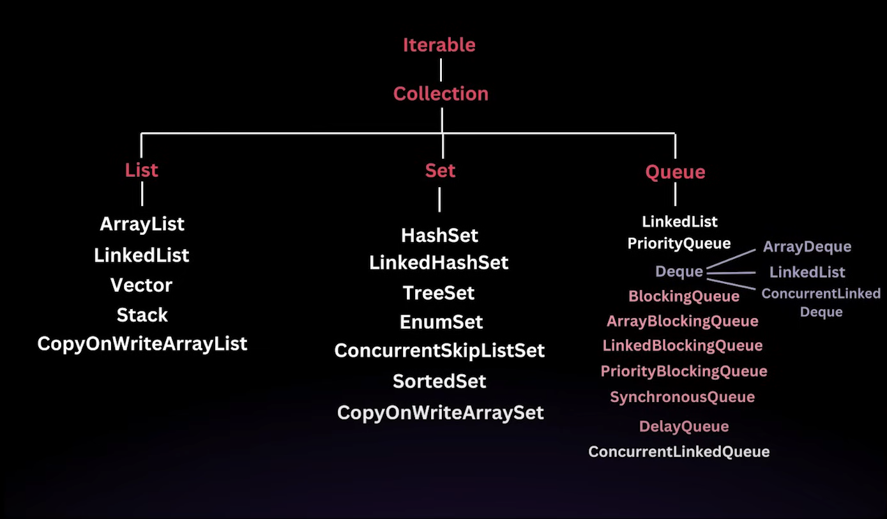

# Java Collection Framework Hierarchy

## Time Complexity Analysis

### List Implementations

| Collection | Add | Remove | Search | Access |
|------------|-----|--------|--------|--------|
| ArrayList | O(1) | O(n) | O(n) | O(1) |
| LinkedList | O(1) | O(1) | O(n) | O(n) |
| Vector | O(1) | O(n) | O(n) | O(1) |
| Stack | O(1) | O(1) | O(n) | O(1) |
| CopyOnWriteArrayList | O(n) | O(n) | O(n) | O(1) |

### Set Implementations

| Collection | Add | Remove | Search |
|------------|-----|--------|--------|
| HashSet | O(1) | O(1) | O(1) |
| LinkedHashSet | O(1) | O(1) | O(1) |
| TreeSet | O(log n) | O(log n) | O(log n) |
| EnumSet | O(1) | O(1) | O(1) |
| ConcurrentSkipListSet | O(log n) | O(log n) | O(log n) |
| SortedSet | O(log n) | O(log n) | O(log n) |
| CopyOnWriteArraySet | O(n) | O(n) | O(n) |

### Queue Implementations

| Collection | Add | Remove | Peek |
|------------|-----|--------|------|
| LinkedList | O(1) | O(1) | O(1) |
| PriorityQueue | O(log n) | O(log n) | O(1) |
| ArrayDeque | O(1) | O(1) | O(1) |
| BlockingQueue | O(1) | O(1) | O(1) |
| ArrayBlockingQueue | O(1) | O(1) | O(1) |
| LinkedBlockingQueue | O(1) | O(1) | O(1) |
| PriorityBlockingQueue | O(log n) | O(log n) | O(1) |
| SynchronousQueue | O(1) | O(1) | O(1) |
| DelayQueue | O(log n) | O(log n) | O(1) |
| ConcurrentLinkedQueue | O(1) | O(1) | O(1) |

### Deque Implementations (implemented by multiple classes)
*Note: Deque is an interface implemented by ArrayDeque, LinkedList, and ConcurrentLinkedDeque*

| Collection | Add | Remove | Peek |
|------------|-----|--------|------|
| ArrayDeque | O(1) | O(1) | O(1) |
| LinkedList | O(1) | O(1) | O(1) |
| ConcurrentLinkedDeque | O(1) | O(1) | O(1) |